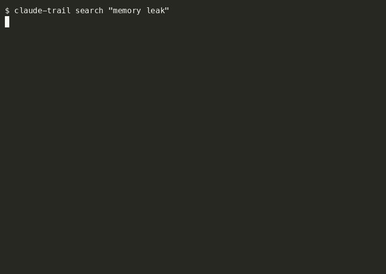

# claude-trail


**Your subagents do real work. By default, it disappears the moment the session ends — and the next time you need it, you pay to redo it.**

A single research or debugging subagent can easily burn tens of thousands of tokens working something out. Without claude-trail, that answer is gone once the session ends — the only way to get it back is to spend those tokens again. claude-trail archives every subagent transcript automatically, the instant it finishes, so "have we solved this before?" is a free, instant search instead of a second full investigation. A local dashboard to browse it, a `search` command to find it, and a skill so Claude checks its own history *before* redoing the work, without you having to ask.




## Why claude-trail

- **Saves tokens, not just time** — re-running a subagent to rediscover something it already figured out can cost as much as the original investigation. Retrieving it from claude-trail costs nothing beyond the search itself: index and `--deep` search are pure local text matching, no LLM call involved.
- **Automatic, not manual** — a `SubagentStop` hook archives the moment a subagent finishes. Nothing to run, nothing to remember.
- **Claude can search its own history** — the bundled `claude-trail-search` skill lets Claude proactively check prior subagent work *before* redoing it, not just you browsing a dashboard afterward.
- **Actually searchable** — index search, full-text `--deep` scans, or paraphrase-aware `--semantic` search, from the CLI, the dashboard, or Claude itself.
- **Optionally captures the main session too** — not just subagent work. Off by default; see [Main-session capture](#main-session-capture).
- **Cheap, cached summaries when you do want one** — task / approach / outcome, generated on-demand via your own `claude` CLI (Haiku by default), cached so you never pay for the same summary twice.
- **Local-only, zero runtime dependencies** — the dashboard binds to `127.0.0.1` only; no telemetry, no external services. Semantic search's embedding model also runs fully locally, no API calls at query time.

## Install

**npm** (recommended):
```
npm install -g @flurryhead/claude-trail
```
Scoped as `@flurryhead/claude-trail` on the registry (the unscoped `claude-trail` name was too close to an existing package) — but it still gives you a plain `claude-trail` command on `PATH`, same as everywhere else in this README.

**Prebuilt binary** — for a machine with no Node installed at all. Download `claude-trail-<platform>-<arch>` for your platform from the [latest release](../../releases/latest), `chmod +x` it, and put it on your `PATH` as `claude-trail`. See [Building binaries](#building-binaries) for how these are built.

**From source** (for contributors):
```
git clone https://github.com/vaibhav1805/claude-trail.git
cd claude-trail
npm link
```
`npm link` puts a `claude-trail` command on your `PATH` backed by this checkout. Every command below assumes `claude-trail` is on `PATH` one way or another — from npm, a downloaded binary, or `npm link`.

## Commands

```
claude-trail configure [--global]                 First-time setup (data dir, hooks) — project-scoped by default
claude-trail clean [--global]                     Remove hooks and stop the background dashboard
claude-trail archive                              Archive a subagent transcript (invoked by the SubagentStop hook)
claude-trail archive-main                         Archive main-session transcript deltas (invoked by PreCompact/SessionEnd;
                                                   no-op unless mainSessionCapture.enabled is true — see Main-session capture)
claude-trail prune                                Prune old archived transcripts (invoked by the SessionStart hook)
claude-trail status                               Print a summary of captured runs
claude-trail search <query> [opts]                Search archived subagent transcripts for context
claude-trail index [--limit N]                    Build/update the local semantic-search embedding index
claude-trail dashboard [--port N] [--background]  Run the local web dashboard
claude-trail service <start|stop|restart|status>  Run/stop the dashboard in the background
claude-trail --version                            Print the installed version
claude-trail --help                               Show this help
```

## Setup

```
claude-trail configure
```

`configure` is idempotent (safe to re-run) and, by default, **project-scoped** — it only wires claude-trail into the project you run it from, so archiving only fires for subagent activity in that project. Run it again with `--global` to instead wire it into every project on the machine:

```
claude-trail configure --global
```

Either way, it:

1. Creates the OS-standard data directory (see below) — **always the same single location regardless of scope**, so a project-scoped and a globally-scoped setup still archive into one shared, searchable place.
2. Writes a default `config.json` there, **only if one doesn't already exist**.
3. Registers four hooks — `SubagentStop → claude-trail archive`, `SessionStart → claude-trail prune` (async), and `PreCompact` / `SessionEnd → claude-trail archive-main` (async) — into `.claude/settings.json` in the current directory by default, or `~/.claude/settings.json` with `--global` — surgically merged in: only claude-trail's own entries are touched, every other tool's hooks in that file are left byte-for-byte untouched. The last two are always wired but no-op unless you turn on `mainSessionCapture` — see [Main-session capture](#main-session-capture).
4. Installs the `claude-trail-search` skill into `.claude/skills/claude-trail-search/` (project-scoped) or `~/.claude/skills/claude-trail-search/` (`--global`) — matching whichever scope you configured — see [Search](#search) below.

You can mix scopes freely — e.g. `configure --global` for blanket coverage everywhere, plus a project-scoped `configure` in one repo does nothing extra (the global hooks already cover it) but is harmless if run anyway.

That's it — the dashboard is **not** started automatically. Archiving needs no background process at all: it's entirely driven by the hooks above, which fire per-event and exit. See [Running the dashboard](#running-the-dashboard) below for starting it when you want it.

`claude-trail clean` (also `[--global]`, matching whichever scope you configured) reverses configure — removes only claude-trail's hook entries and skill, and stops the background dashboard if one is running — but **leaves the data directory in place** so you decide whether to keep your archive.

The registered hooks invoke the exact binary that was active when you ran `configure` — either the resolved `node` + script path (source or npm install) or the SEA binary itself (no Node needed on the machine at all, in that case) — never a bare `node`/`claude-trail` relying on `PATH`. This matters because hook runners often run with a minimal environment that can't resolve commands via `PATH` or `#!/usr/bin/env node`.

## Configuration

Edit `config.json` in the data directory:

```json
{
  "retentionDays": 30,
  "webPort": 4870,
  "summaryMode": {
    "enabled": true,
    "model": "haiku"
  },
  "mainSessionCapture": {
    "enabled": false
  },
  "semanticSearch": {
    "enabled": false,
    "model": "Xenova/all-MiniLM-L6-v2",
    "autoIndexLimit": 20
  }
}
```

- `retentionDays` — how long archived transcripts and index entries are kept before `claude-trail prune` removes them. Defaults to 30 if missing or invalid.
- `webPort` — the port `claude-trail dashboard` binds to. Defaults to 4870 if missing or invalid.
- `summaryMode.enabled` — whether the "Summary" tab and `/api/summary` endpoint are available. Defaults to `true`.
- `summaryMode.model` — the model alias passed to `claude -p --model`. Defaults to `haiku`.
- `mainSessionCapture.enabled` — whether `PreCompact`/`SessionEnd` actually archive anything (the hooks are always wired, this just gates them). Defaults to `false`. See [Main-session capture](#main-session-capture).
- `semanticSearch.enabled` — whether `claude-trail prune`'s `SessionStart` hook also auto-indexes a small bounded batch of new entries. `claude-trail index` and `search --semantic` work regardless of this flag; it only controls the automatic background pass. Defaults to `false`. See [Semantic search](#semantic-search).
- `semanticSearch.model` — the embedding model `claude-trail index`/`search --semantic` use. Defaults to `Xenova/all-MiniLM-L6-v2`.
- `semanticSearch.autoIndexLimit` — max entries the auto-index pass embeds per `prune` run, bounding it under the `SessionStart` hook's timeout. Defaults to 20.

## Data directory

Replaces "wherever the repo happens to be cloned" from earlier versions of this tool — `config.json`, `index.jsonl`, `hook-errors.log`, `dashboard.pid` (only present while the background dashboard is running), and `archive/` all live here instead:

- macOS: `~/Library/Application Support/claude-trail`
- Linux: `$XDG_DATA_HOME/claude-trail` or `~/.local/share/claude-trail`
- Windows: `%APPDATA%\claude-trail`

If you have an older local clone with data at the repo root (`config.json`, `index.jsonl`, `archive/`, `hook-errors.log`), move it into the new data directory by hand — this is a one-time manual step, not something `configure` automates.

## Running the dashboard

Not a boot service — the dashboard is something you open occasionally to browse captures, not something that needs to survive a reboot, so there's no OS-level install (no launchd/systemd/Task Scheduler entry). Two ways to run it:

**Foreground**, for a one-off look — exits when you close the terminal or hit Ctrl+C:
```
claude-trail dashboard
```

**Background**, to keep it running after you close the terminal — a plain detached Node process tracked by a pidfile at `<data dir>/dashboard.pid`, not an OS service:
```
claude-trail dashboard --background
# or, equivalently:
claude-trail service start
```
`claude-trail service <start|stop|restart|status>` manages that background process. It does **not** survive a reboot — run `claude-trail service start` again after restarting your machine if you want it back. Logs go to `<data dir>/logs/dashboard.log`.

## Viewing captured runs

**Quick summary:**
```
claude-trail status
```
Prints the data directory, total entries, a breakdown by `agent_type`, oldest/newest capture timestamps, current `retentionDays`, and on-disk archive size.

**Dashboard:**
```
claude-trail dashboard
```
Then open `http://127.0.0.1:<webPort>` (default `4870`) — see [Running the dashboard](#running-the-dashboard) above for foreground vs. background. Left sidebar lists captured runs, filterable by `agent_type`, text, or `cwd`; right pane shows the transcript for whatever row you click.

The transcript view drops pure harness/session bookkeeping lines (`mode`, `permission-mode`, `file-history-snapshot`, `file-history-delta`, `attachment`, `last-prompt`, `ai-title`, `queue-operation`, `system`) — only `user`/`assistant` message content is shown. Display-time filter only; the archived `.jsonl` file itself is untouched.

No runtime dependencies — the dashboard uses only Node's built-in `http`, `fs`, `path`, `url`, and `child_process` modules.

### Summary mode

A "Summary" tab next to "Trace" generates a short, structured summary (task / approach / outcome / notable issues) instead of showing the full trace. On-demand — nothing is generated until you click the tab.

Works by shelling out to the local `claude` CLI in headless mode (`claude -p --bare --tools ""`), reusing whatever auth your Claude Code install already has — no separate API key. Tool use and hooks are disabled for this call; it only ever reads the prompt text it's given and returns text. Each summary is cached to `<archived-transcript>.summary.json` next to the transcript, so re-opening an entry doesn't re-run the LLM call — "Regenerate" forces a refresh. `claude-trail prune` removes these cache files along with their transcript when an entry ages out.

## Main-session capture

Subagent work is archived automatically, but the main session's own conclusions previously vanished the same way at compaction or session end. `PreCompact`/`SessionEnd` hooks (always wired by `configure`, but off by default — see `mainSessionCapture.enabled` in [Configuration](#configuration)) capture that too, once turned on:

```json
{ "mainSessionCapture": { "enabled": true } }
```

Captures only the transcript **delta** since the last checkpoint — a per-session cursor (`<data dir>/cursors/<session_id>.json`) tracks how much of the transcript has already been archived, so back-to-back compactions in the same session don't re-copy the whole (ever-growing) transcript file each time. Archived under `agent_type: "main-session"`, in the same `archive/`/`index.jsonl` layout as subagent entries — `search`, `--type main-session`, the dashboard, and `--semantic` all pick it up with no separate handling needed.

**Off by default deliberately**: main-session transcripts carry your own prompts, not just scoped subagent work — a materially bigger privacy surface than what claude-trail captures otherwise. Turn it on only if you want that traded for the same "have we solved this before?" recall subagent work already gets.

## Search

```
claude-trail search <query> [--type <agent_type>] [--limit N] [--deep] [--json]
claude-trail search <query> --semantic [--limit N] [--min-score N] [--json]
claude-trail search --show <archive_path>
```

Searches the index (`agent_type`, `cwd`, last assistant message) by default — fast, but only matches what's already summarized in `index.jsonl`. Pass `--deep` to also scan the full transcript body of each entry, which is slower but catches matches that only appear mid-conversation. `--show <archive_path>` (the path a search result prints) prints the full cleaned transcript for one entry. `--json` gives structured output for scripting or for another tool/agent to consume.

`skills/claude-trail-search/SKILL.md` is a Claude Code skill that wraps the command above — it tells Claude when to proactively run `claude-trail search` (e.g. "have we hit this before?" or "what did that earlier subagent actually do?") instead of you having to invoke the CLI yourself. It's a thin wrapper: all the actual searching happens in the CLI command above; the skill just adds the trigger and usage notes so Claude reaches for it unprompted when archived context is likely relevant.

`configure` installs it automatically — into `.claude/skills/claude-trail-search/` in the current project by default, or `~/.claude/skills/claude-trail-search/` with `--global` (from source or an npm install, that's a symlink back to the package's own copy, so it stays in sync; from a prebuilt binary it's a real file copy, since there's no source tree next to a single-file executable to link to). `clean` removes it. No separate step needed.

### Semantic search

Lexical search (`--deep` included) only matches shared words — a paraphrase of something you know is archived (different wording, same idea) can return nothing even though the content is directly relevant. `--semantic` ranks archived entries by embedding similarity instead:

```
claude-trail index                              # build/update the local embedding index (first run downloads the model)
claude-trail search "your query" --semantic     # rank by similarity instead of word overlap
```

`claude-trail index` is a separate, explicit step — not run inline in the `SubagentStop` hook, which has a hard 10-second timeout and must never risk blocking subagent completion on a model load. Run it manually whenever you want the index refreshed, or turn on `semanticSearch.enabled` to let `prune`'s `SessionStart` hook auto-index a small bounded batch of new entries in the background.

Uses a small local model (`Xenova/all-MiniLM-L6-v2` via the optional `@huggingface/transformers` dependency) — inference happens entirely on your machine, no API calls at query time. It's an `optionalDependency`: a plain `npm install` or the SEA binaries work fine without it, and only `index`/`--semantic` need it (the SEA binaries can't bundle its native addon at all — semantic search is npm/source-only).

`--min-score N` (default `0.08`) filters out low-similarity noise — without a floor, `--semantic` would just return every indexed entry sorted by score. This default is deliberately conservative: absolute similarity scores for this model run lower than intuition suggests on long, multi-topic entries, so a genuine match can score as low as ~0.15. Read the score gap between your top result and the rest — a large gap is a strong signal of a real match; a flat, similar-scored list of several results is a sign the query didn't land on anything specific.

## Building binaries

```
npm run build:binary
```

Produces a single self-contained executable at `dist/claude-trail-<platform>-<arch>` — a Node [Single Executable Application (SEA)](https://nodejs.org/api/single-executable-applications.html): esbuild bundles the CLI into one file, Node's `--experimental-sea-config` turns that into a blob, [postject](https://github.com/nodejs/postject) injects the blob (plus the dashboard's `index.html` and the claude-trail-search `SKILL.md`, both embedded as named assets since there's no sibling file tree next to a single-file binary) into a copy of the `node` binary that built it. Only builds for the platform/arch you run it on — there's no cross-compiling a macOS binary from Linux, since it starts from a copy of the *running* `node` executable.

`.github/workflows/build-binaries.yml` runs this on a 4-platform matrix (macOS arm64, macOS x64, Linux x64, Windows x64) whenever a `v*.*.*` tag is pushed, and attaches the resulting binaries to a GitHub Release for that tag — this is what [Install](#install) above points at.

**macOS caveat:** the binary is ad-hoc signed (`codesign --sign -`) as part of the build — required for it to launch at all once postject strips Node's original signature — but that's *not* the same as notarization. Gatekeeper will still flag it as being from an "unidentified developer" on first run. Real notarization (an Apple Developer certificate + Apple's notary service) is a deliberately deferred, separate piece of work.

## vs. claude-code-log

[claude-code-log](https://github.com/daaain/claude-code-log) is a related, more mature tool worth knowing about — different enough in approach that picking the right one matters:

| | claude-trail | claude-code-log |
|---|---|---|
| **Capture** | Automatic, live — a hook fires the moment a subagent finishes | Manual, post-hoc — you run it against transcripts that already exist |
| **Scope** | Subagent transcripts by default; main-session capture is opt-in | Any Claude Code transcript — full sessions, whole projects |
| **Interface** | Local dynamic web dashboard + CLI | Static HTML/Markdown export + TUI |
| **Search** | CLI + dashboard — index, full-text (`--deep`), or paraphrase-aware `--semantic` | Browser-side filtering, natural-language date ranges |
| **Claude-callable** | Yes — a skill lets Claude query its own history mid-session | Not documented — appears to be a standalone viewer |
| **Summaries** | On-demand LLM summary per entry | Token-usage stats, no LLM summarization |
| **Retention** | Configurable auto-prune (`retentionDays`) | No built-in retention management — reads whatever transcripts already exist |
| **Install** | Node.js — npm, prebuilt binary, or source | Python — pip, uvx, or source |

Rough rule of thumb: reach for claude-trail if you want subagent work captured automatically and queryable by Claude itself. Reach for claude-code-log if you want a richer, more established viewer/exporter for full session history — timelines, token stats, multi-provider (Codex, Antigravity) support, commit-SHA linking.

## Privacy / safety

- Archived transcripts can contain anything a subagent read, wrote, or discussed — treat the data directory like any other sensitive local data.
- Main-session capture (`mainSessionCapture.enabled`, off by default) archives your own prompts too, not just subagent-scoped work — a bigger privacy surface than the default. See [Main-session capture](#main-session-capture) before turning it on.
- The dashboard binds to `127.0.0.1` only; it is never reachable from outside the machine.
- The `/api/transcript` and `/api/summary` endpoints resolve and check the requested path stays under the archive directory, guarding against path traversal.
- `claude-trail archive` (the `SubagentStop` hook) and `claude-trail archive-main` (`PreCompact`/`SessionEnd`) fail safe: any error is logged to `hook-errors.log`, and both always exit 0 so they never block a subagent or the main session from completing.
- Summary mode sends transcript content to the model via your existing local `claude` CLI session — the same trust boundary as any other Claude Code usage on this machine, just triggered from this tool instead of interactively.
- Semantic search's embedding model runs fully locally (via the optional `@huggingface/transformers` dependency) — no transcript content is sent anywhere at index or query time.
- `configure` only ever edits the `SubagentStop`, `SessionStart`, `PreCompact`, and `SessionEnd` arrays in the target `settings.json` (project-level by default, `~/.claude/settings.json` with `--global`), and only the specific entries it owns within them — verified against a real `~/.claude/settings.json` with several other tools' hooks already registered.
