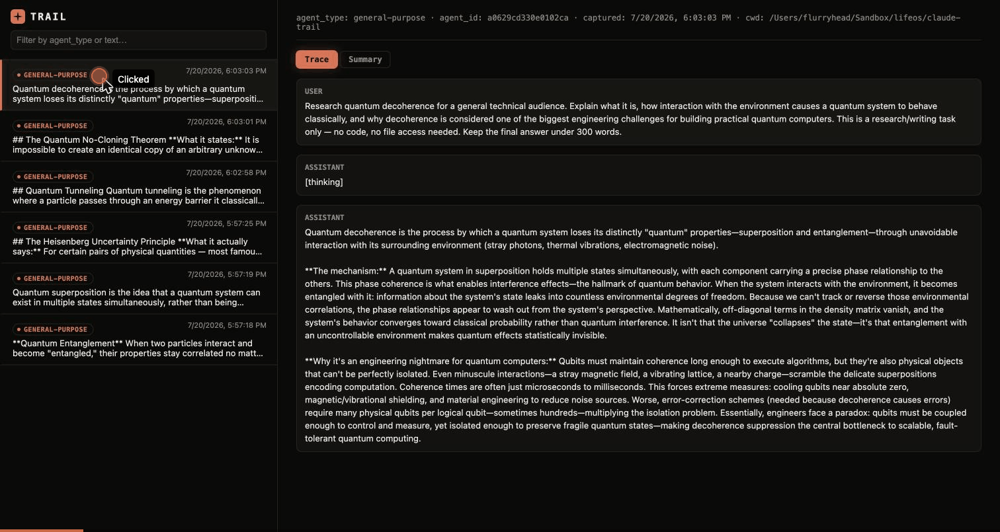

# claude-trail

A small, dependency-free Node.js CLI that archives Claude Code subagent transcripts as they complete, so past subagent work stays searchable instead of disappearing when a session ends. Includes a local web dashboard for browsing captures.



> **Status:** prebuilt binaries (no Node required) are built by CI and attached to [GitHub Releases](../../releases) — see [Building binaries](#building-binaries) below. A one-line `curl | sh` / `install.ps1` installer that downloads, verifies, and runs `configure` for you doesn't exist yet — for now, download the binary for your platform from a release, or run from source with plain Node (see [Running from source](#running-from-source)).

## Commands

```
claude-trail configure                           First-time setup (data dir, hooks)
claude-trail clean                                Remove hooks and stop the background dashboard
claude-trail archive                              Archive a subagent transcript (invoked by the SubagentStop hook)
claude-trail prune                                Prune old archived transcripts (invoked by the SessionStart hook)
claude-trail status                               Print a summary of captured runs
claude-trail search <query> [opts]                Search archived subagent transcripts for context
claude-trail dashboard [--port N] [--background]  Run the local web dashboard
claude-trail service <start|stop|restart|status>  Run/stop the dashboard in the background
claude-trail --version                            Print the installed version
claude-trail --help                               Show this help
```

## Running from source

```
node bin/claude-trail.js configure
```

This is the whole setup flow for now — clone the repo, run `configure` with plain Node. `configure` is idempotent (safe to re-run) and:

1. Creates the OS-standard data directory (see below).
2. Writes a default `config.json` there, **only if one doesn't already exist**.
3. Registers two hooks in your **global** `~/.claude/settings.json` — `SubagentStop → claude-trail archive` and `SessionStart → claude-trail prune` (async) — surgically merged in: only claude-trail's own entries are touched, every other tool's hooks in that file are left byte-for-byte untouched.

That's it — the dashboard is **not** started automatically. Archiving needs no background process at all: it's entirely driven by the two hooks above, which fire per-event and exit. See [Running the dashboard](#running-the-dashboard) below for starting it when you want it.

`claude-trail clean` reverses configure — removes only claude-trail's hook entries and stops the background dashboard if one is running — but **leaves the data directory in place** so you decide whether to keep your archive.

The registered hooks invoke the exact Node binary and script path that were active when you ran `configure` (`process.execPath` + the resolved script path) — not a bare `node` on PATH. This matters because hook runners often run with a minimal environment that can't resolve `node` via `#!/usr/bin/env node`. Run `configure` from a prebuilt binary instead of `node bin/claude-trail.js` and the hooks reference that binary directly — no Node install needed on the machine at all.

## Building binaries

```
npm run build:binary
```

Produces a single self-contained executable at `dist/claude-trail-<platform>-<arch>` — a Node [Single Executable Application (SEA)](https://nodejs.org/api/single-executable-applications.html): esbuild bundles the CLI into one file, Node's `--experimental-sea-config` turns that into a blob, [postject](https://github.com/nodejs/postject) injects the blob (plus the dashboard's `index.html`, embedded as a named asset) into a copy of the `node` binary that built it. Only builds for the platform/arch you run it on — there's no cross-compiling a macOS binary from Linux, since it starts from a copy of the *running* `node` executable.

`.github/workflows/build-binaries.yml` runs this on a 4-platform matrix (macOS arm64, macOS x64, Linux x64, Windows x64) whenever a `v*.*.*` tag is pushed, and attaches the resulting binaries to a GitHub Release for that tag. No installer script consumes these yet (see the status note above) — for now, grab the right binary from a release and run it directly.

**macOS caveat:** the binary is ad-hoc signed (`codesign --sign -`) as part of the build — required for it to launch at all once postject strips Node's original signature — but that's *not* the same as notarization. Gatekeeper will still flag it as being from an "unidentified developer" on first run. Real notarization (an Apple Developer certificate + Apple's notary service) is a deliberately deferred, separate piece of work.

## Data directory

Replaces "wherever the repo happens to be cloned" from earlier versions of this tool — `config.json`, `index.jsonl`, `hook-errors.log`, `dashboard.pid` (only present while the background dashboard is running), and `archive/` all live here instead:

- macOS: `~/Library/Application Support/claude-trail`
- Linux: `$XDG_DATA_HOME/claude-trail` or `~/.local/share/claude-trail`
- Windows: `%APPDATA%\claude-trail`

If you have an older local clone with data at the repo root (`config.json`, `index.jsonl`, `archive/`, `hook-errors.log`), move it into the new data directory by hand — this is a one-time manual step, not something `configure` automates.

## Running the dashboard

Not a boot service — the dashboard is something you open occasionally to browse captures, not something that needs to survive a reboot, so there's no OS-level install (no launchd/systemd/Task Scheduler entry). Two ways to run it:

**Foreground**, for a one-off look — exits when you close the terminal or hit Ctrl+C:
```
claude-trail dashboard
```

**Background**, to keep it running after you close the terminal — a plain detached Node process tracked by a pidfile at `<data dir>/dashboard.pid`, not an OS service:
```
claude-trail dashboard --background
# or, equivalently:
claude-trail service start
```
`claude-trail service <start|stop|restart|status>` manages that background process. It does **not** survive a reboot — run `claude-trail service start` again after restarting your machine if you want it back. Logs go to `<data dir>/logs/dashboard.log`.

## Viewing captured runs

**Quick summary:**
```
node bin/claude-trail.js status
```
Prints the data directory, total entries, a breakdown by `agent_type`, oldest/newest capture timestamps, current `retentionDays`, and on-disk archive size.

**Dashboard:**
```
node bin/claude-trail.js dashboard
```
Then open `http://127.0.0.1:<webPort>` (default `4870`) — see [Running the dashboard](#running-the-dashboard) above for foreground vs. background. Left sidebar lists captured runs, filterable by `agent_type`, text, or `cwd`; right pane shows the transcript for whatever row you click.

The transcript view drops pure harness/session bookkeeping lines (`mode`, `permission-mode`, `file-history-snapshot`, `file-history-delta`, `attachment`, `last-prompt`, `ai-title`, `queue-operation`, `system`) — only `user`/`assistant` message content is shown. Display-time filter only; the archived `.jsonl` file itself is untouched.

No runtime dependencies — the dashboard uses only Node's built-in `http`, `fs`, `path`, `url`, and `child_process` modules.

### Summary mode

A "Summary" tab next to "Trace" generates a short, structured summary (task / approach / outcome / notable issues) instead of showing the full trace. On-demand — nothing is generated until you click the tab.

Works by shelling out to the local `claude` CLI in headless mode (`claude -p --bare --tools ""`), reusing whatever auth your Claude Code install already has — no separate API key. Tool use and hooks are disabled for this call; it only ever reads the prompt text it's given and returns text. Each summary is cached to `<archived-transcript>.summary.json` next to the transcript, so re-opening an entry doesn't re-run the LLM call — "Regenerate" forces a refresh. `claude-trail prune` removes these cache files along with their transcript when an entry ages out.

### Searching archives

```
claude-trail search <query> [--type <agent_type>] [--limit N] [--deep] [--json]
claude-trail search --show <archive_path>
```

Searches the index (`agent_type`, `cwd`, last assistant message) by default — fast, but only matches what's already summarized in `index.jsonl`. Pass `--deep` to also scan the full transcript body of each entry, which is slower but catches matches that only appear mid-conversation. `--show <archive_path>` (the path a search result prints) prints the full cleaned transcript for one entry. `--json` gives structured output for scripting or for another tool/agent to consume.

This is also what the `claude-trail-search` Claude Code skill (see [Skill](#skill)) calls under the hood to pull prior context into a session.

## Skill

`skills/claude-trail-search/SKILL.md` is a Claude Code skill (installed separately to `~/.claude/skills/claude-trail-search/`) that tells Claude when to proactively run `claude-trail search` — e.g. "have we hit this before?" or "what did that earlier subagent actually do?" — instead of you having to invoke the CLI yourself. It's a thin wrapper: all the actual searching happens in `claude-trail search`/`--show` above: the skill just adds the trigger and usage notes so Claude reaches for it unprompted when archived context is likely relevant.

## Configuration

Edit `config.json` in the data directory:

```json
{
  "retentionDays": 30,
  "webPort": 4870,
  "summaryMode": {
    "enabled": true,
    "model": "haiku"
  }
}
```

- `retentionDays` — how long archived transcripts and index entries are kept before `claude-trail prune` removes them. Defaults to 30 if missing or invalid.
- `webPort` — the port `claude-trail dashboard` binds to. Defaults to 4870 if missing or invalid.
- `summaryMode.enabled` — whether the "Summary" tab and `/api/summary` endpoint are available. Defaults to `true`.
- `summaryMode.model` — the model alias passed to `claude -p --model`. Defaults to `haiku`.

## Privacy / safety

- Archived transcripts can contain anything a subagent read, wrote, or discussed — treat the data directory like any other sensitive local data.
- The dashboard binds to `127.0.0.1` only; it is never reachable from outside the machine.
- The `/api/transcript` and `/api/summary` endpoints resolve and check the requested path stays under the archive directory, guarding against path traversal.
- `claude-trail archive` (the `SubagentStop` hook) fails safe: any error is logged to `hook-errors.log`, and it always exits 0 so it never blocks a subagent from completing.
- Summary mode sends transcript content to the model via your existing local `claude` CLI session — the same trust boundary as any other Claude Code usage on this machine, just triggered from this tool instead of interactively.
- `configure` only ever edits the `SubagentStop` and `SessionStart` arrays in `~/.claude/settings.json`, and only the specific entries it owns within them — verified against a real settings.json with several other tools' hooks already registered.
